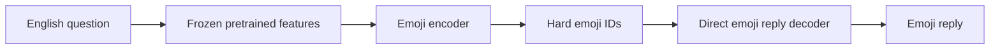

# 🫪 Premade-data experiment 📚🧠🔬

📚 These question–answer pairs come from **UltraChat 200k**.
No new Q&A labels are generated through an API. The existing English answers
provide reconstruction and answer-state targets during training. 🏋️✨



🏋️ During training, the same encoder also reads existing English reference answers.
A frozen pretrained English decoder with a trainable input adapter reconstructs text from the selected emoji IDs.
That decoder supplies a training loss and is absent from the runtime checkpoint.
The reply decoder learns to predict the answer's emoji states from the question's
emoji states. It generates directly from hard states and emoji prefixes. 🧩💬🫪

🌈 The meaning map initializes frozen semantic embeddings with
[all-MiniLM-L6-v2](https://huggingface.co/sentence-transformers/all-MiniLM-L6-v2):
80% literal-core descriptions and 20% descriptions with associations.
Fixed English word vectors separately feed the training-only reconstruction decoder.
Lexical matches add weak grounding supervision.
Ambiguous shared associations are skipped; literal matches retain priority. It does not establish factual or compositional correctness. 🚧🔍

🛠️ A grounding warm-up precedes reconstruction. The learned encoder adjustment
is bounded relative to its semantic initialization. Reply training is blocked
when validation states collapse to fewer than four symbols. The initial raw-word
embedding experiments collapsed and are retained as failed experiments. 🧪📉🚧

🧪 Reconstruction is checked with real, reversed, and zeroed states. Reply evaluation
reports agreement with learned reference states and lexical anchor recall.
Neither metric is a general-chat accuracy score. A collapsed code language could
score well without answering correctly. Examine examples and symbol usage. 📊🧠🚧

💾 Source pages and derived-file hashes are retained. Training uses `train_sft`;
held-out pairs come from `test_sft` and are hash-partitioned into validation/test.
Exact prompt deduplication is applied. Paraphrase overlap is not exhaustively audited.
Long pairs are rejected rather than silently truncated. 📚✅

🔗 [Dataset card](https://huggingface.co/datasets/HuggingFaceH4/ultrachat_200k)
and [row API](https://huggingface.co/docs/dataset-viewer/en/rows). The dataset uses
the MIT license. This pilot is a short-pair subset, not the full 200k dataset. 🫪📚✨

## 🧩 Objective revision 🏋️

`objective-v3` adds ordered contextual reconstruction from hard emoji vectors.
A reversed-slot contrast discourages losing order. This is a proxy for relationships,
not a guarantee that negation, actors, or actions are preserved. 🔍🚧

English reconstruction masks 50% of teacher-forced prefix tokens and adds margin
losses against reversed and zero states using the same mask. A training-only input
adapter aligns emoji vectors with the frozen English decoder. The adapter and
ordered-content projection are absent from runtime. Audits also remove the whole
English prefix to measure dependence on states. 🧠🫪

`emoji_grounded_eval.py` contains 12 fixed human-authored, evaluation-only checks:
literal answer concepts, forbidden symbols, participant order, and prohibition.
These checks never train or select checkpoints. They accept specified emoji
alternatives and are deliberately strict. Passing them is not general-chat
validation; arbitrary ordering alone does not establish reasoning. 📋✅

```powershell
.venv\Scripts\python.exe -X utf8 emoji_grounded_fit.py --name objective-v3 --grounding-steps 300 --reconstruction-steps 40 --reply-steps 800
.venv\Scripts\python.exe -X utf8 emoji_grounded_eval.py --name objective-v3
```

📊 **Objective trial result:** real-state English loss 3.511 versus empty 3.747;
with the whole prefix masked, 10.798 versus 11.299. Lower is better.
Reversed states remain better (3.505 / 10.603), so ordered meaning is unproven.
These are within-run comparisons on three validation examples; the new adapter
changes the decoder, so absolute losses across experiments are not controlled. 🔍🚧

💬 Fixed answer checks remain **2/12**, with **0/4** participant-order checks.
The runtime export excludes the English decoder, its adapter, and the ordered
projection. **75 tests pass.** No general-use claim or checkpoint promotion.
[Full result](objective-result.json). 🫪📋
